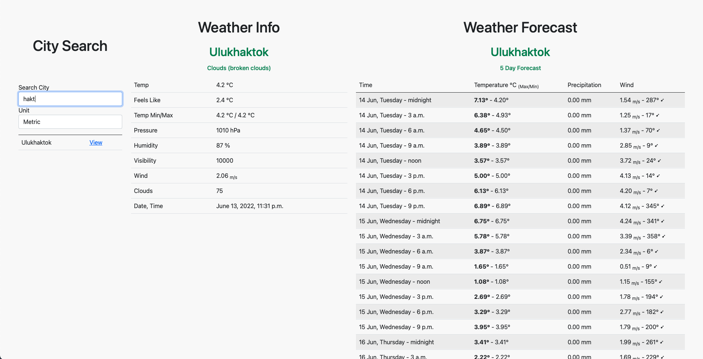

# Weather App 🌤
Weather and Forecast Monitoring Web Application

## Table of Contents

<!--ts-->
* [Used Technologies](#used-technologies)
* [Prerequisites](#prerequisites)
* [Running](#running)
* [Admin Panel](#admin-panel)
* [Features](#features)
* [Views and Endpoints](#views--endpoints)
* [Test](#tests)
* [Logs](#logs)
* [Repository](#repository)
* [License](#license)
<!--te-->

## Used Technologies

### Python / Django

Django was preferred because backend and view will be used together in this project.
However, it may be more appropriate to use _django-rest-framework_ for further development of the project.

### SQLite

SQLite was used to make the project available quickly in different environments.
Thus, there was no need to run a stand-alone database.
<br><br><br>
_This project is backend based, but Bootstrap and JS are used to make frontend improvements fast._

## Prerequisites

Weather App is written in Python with Django Framework.
Other library requirements are listed in `requirements.txt`, to install with pip use following command:<br>
```bash
pip3 install requirements.txt
```


## Running

```bash
python3 manage.py runserver 8000
```

Then app will be available on `http://127.0.0.1:8000` as shown:



## Usage

1. Select unit type
2. Start typing the city name
3. Click the view button next to the city name
4. Enjoy!

## Admin Panel

Default Django admin panel is available on `http://127.0.0.1:8000/admin`

You can create new superuser with following command:
```bash
python3 manage.py createsuperuser
```

**Default Super User Credentials:**
- **Username:** _weather_app_admin_
- **Password:** _weather12345_

## Features

- **Instant Search** <br> 
    User can search cities instantly on home page without seeking within pages.
- **Unit** <br>
    User can choose unit while searching cities.
- **Cookie for Last Viewed City**<br>
    When the user enters the page, the last viewed city information is kept and the weather for that city is displayed.
    If the city is changed, the cookie information is also updated. This method is also applied to unit data.
- **Import Cities Command**<br>
    User can import cities via Django command line interface with using<br> `python3 manage.py import_cities docs/city.list.json` command.

## Views / Endpoints

### City Search

|    Parameter     |  Required  | Method  |   Type    |   Description   |
|:----------------:|:----------:|:-------:|:---------:|:---------------:|
|  `search_query`  |    Yes     |  `GET`  | `string`  | Minimum 2 char  |

### Main View

| Parameter | Required |  Method  |   Type    | Description |
|:---------:|:--------:|:--------:|:---------:|:-----------:|
| `city_id` |   Yes    |  `GET`   | `integer` |  City #ID   |
|  `unit`   |    No    |  `GET`   | `string`  |  Unit Type  |


## Tests

Tests are available under `WeatherApp/WeatherApp/tests` directory. Django test base was used.
You can simply run test using following command.

```bash
python3 manage.py test
```

## Logs

Stored under `WeatherApp/logs/` directory.

## Repository

This project available at <a href="https://github.com/eminsafa/Weather-App">eminsafa/Weather-App</a>

## License
[MIT](https://choosealicense.com/licenses/mit/)

